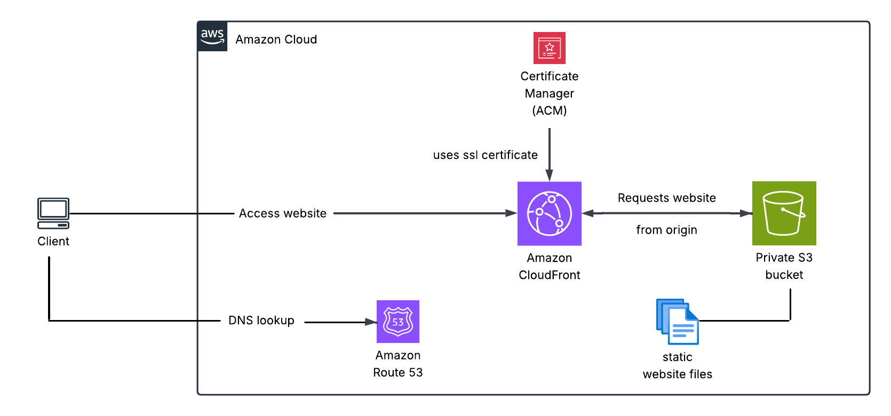

# aws-static-website-hosting
Hosted a static website on AWS using S3, Route 53, CloudFront, and ACM with a custom domain and HTTPS enabled.

# 🌐 Static Website Hosting on AWS

## 🚀 Project Overview
This project demonstrates how to host a static website on AWS with a custom domain and HTTPS security.  

I used the following AWS services:  
- **Amazon S3** → For static website file storage (with public access blocked for security).  
- **Amazon Route 53** → For DNS management and domain integration.  
- **AWS Certificate Manager (ACM)** → For issuing and managing SSL/TLS certificates.  
- **Amazon CloudFront** → For global content delivery, caching, and HTTPS redirection.

---

## 🏗️ Architecture

**Workflow:**  
1. Website files are stored in an **S3 bucket** (public access blocked, accessed only through CloudFront).  
2. **CloudFront** is configured to serve the S3 content securely, with **HTTP → HTTPS redirection enabled**.  
3. A domain purchased from **BigRock** was integrated by changing its name servers to match the **Route 53 hosted zone**.  
4. **AWS Certificate Manager** provides SSL/TLS certificates for secure HTTPS access.  

---

## ✨ Key Features
- Secure website hosting with **S3 public access blocked**.  
- **Custom domain** purchased from BigRock, managed via Route 53.  
- **HTTPS enforced** (automatic HTTP → HTTPS redirection in CloudFront).  
- Globally distributed website via CloudFront CDN.  

---

## 📚 Skills Gained
- AWS S3 bucket policies & security best practices.  
- DNS configuration and domain integration with Route 53.  
- SSL/TLS certificate provisioning with ACM.  
- CloudFront distribution setup with caching & HTTPS redirection.  
